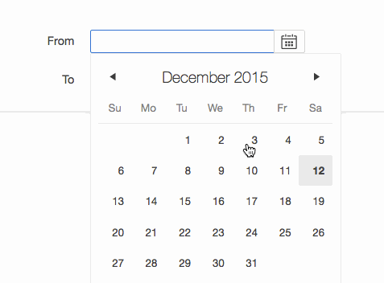

# OraOpenSource From/To Date Plugin

**Demo:** [https://apex.oracle.com/pls/apex/f?p=90366:200](https://apex.oracle.com/pls/apex/f?p=90366:200)

This item plugin mimics the native date item type. The main difference is that instead of having Minimum and Maximum date attributes you now have Date Type and Corresponding Date Item attributes. The Date Type can either be a `From` or `To date` (i.e. min/max date). The Corresponding Date Item is the item name for the date picker that will determine the date's restrictions(in real time based on the corresponding date's current date).

*Note: Previously called ClariFit From/To Date Picker. To ensure backwards compatibility the internal name of this plugin is still: `COM.CLARIFIT.FROMTODATEPICKER`*

## Sponsors

Special thanks to [Insum Solutions](http://www.insum.ca) for sponsoring this plugin.

# Development

TODO

node node.js/app.js
// https://localhost:3443/www
